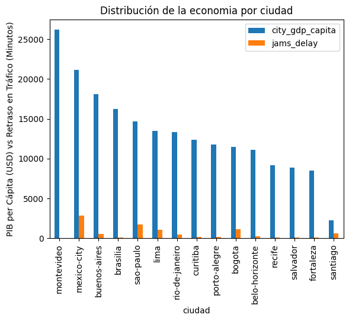
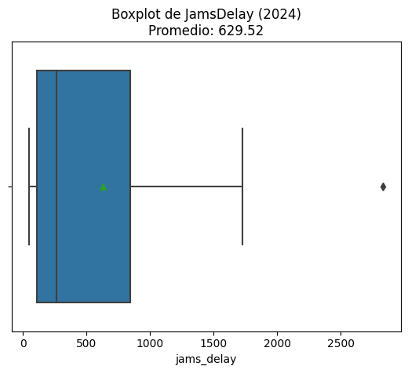

# Movilidad urbana y productividad económica en Latinoamérica

Análisis de la relación entre la congestión vehicular y el PIB per cápita en 15 ciudades latinoamericanas durante 2024. El caso: un banco de desarrollo necesita decidir en qué ciudades priorizar la inversión en infraestructura de transporte.

**Resultado principal:** una ciudad más rica no es una ciudad más congestionada. El PIB per cápita, por sí solo, no explica la congestión.

[Ver el notebook](movilidad_urbana_economia_latam.ipynb) · [Abrir en Google Colab](https://colab.research.google.com/github/fvt1999pipe-eng/ladb_mobility_economy_project/blob/main/movilidad_urbana_economia_latam.ipynb)

## Pregunta de negocio

¿Las ciudades con mayor PIB per cápita tienen más congestión? La hipótesis de partida es que las ciudades con mucha congestión y baja productividad son las que más se beneficiarían de la inversión en transporte.

## Resultados

| Ciudad | PIB per cápita (USD) | Retraso promedio por congestión (minutos) |
|---|---|---|
| Montevideo | 26.176, el más alto de la muestra | 50, el más bajo |
| Ciudad de México | 21.111, el segundo más alto | 2.833, el más alto |
| São Paulo | 14.703 | 1.729 |
| Bogotá | 11.442 | 1.142 |

- No hay una relación lineal clara entre el PIB per cápita y la congestión.
- Ciudad de México supera en más de cuatro veces el promedio de la muestra (630 minutos).
- Según la hipótesis, Bogotá y São Paulo son las candidatas más claras para estudios de viabilidad: combinan congestión alta con un PIB per cápita intermedio.



*PIB per cápita y retraso por ciudad. Ordenadas de mayor a menor PIB, las barras de retraso no siguen ningún patrón.*



*Distribución del retraso por congestión. El promedio es de 630 minutos, pero Ciudad de México queda muy por fuera del resto.*

## Datos

| Archivo | Filas | Contenido |
|---|---|---|
| `tomtom_traffic.csv` | 1.004.464 | Registros de tráfico de TomTom Traffic Index para ciudades de todo el mundo: retraso por atascos, índice de tráfico, longitud y número de atascos, y tiempos de viaje. |
| `oecd_city_economy.csv` | 30 | Indicadores de OECD Cities para 15 ciudades latinoamericanas en 2023 y 2024: PIB per cápita, desempleo, PM2.5 y población. |

Los datos son un caso de estudio del bootcamp de Análisis de Datos de TripleTen y no se incluyen en el repositorio.

## Metodología

1. **Exploración** de la estructura y los tipos de datos de las dos fuentes.
2. **Limpieza:** nombres de columnas en `snake_case`, fechas convertidas a tipo `datetime` y números sin separadores de miles ni símbolos de porcentaje.
3. **Filtro** de los registros de 2024.
4. **Agregación:** promedio anual de las métricas de tráfico por ciudad.
5. **Integración** de las dos fuentes por ciudad y año.
6. **Visualización:** diagrama de caja del retraso, histograma del PIB per cápita y comparación de ambas variables por ciudad.
7. **Exportación** del dataset limpio (`ladb_mobility_economy_2024_clean.csv`).

## Limitaciones y próximos pasos

- Santiago aparece con un PIB per cápita muy inferior al del resto de la muestra; conviene validar ese dato en la fuente.
- Medir la relación con un coeficiente de correlación e incluir la población como variable de control.
- Agrupar las ciudades en segmentos según congestión y productividad.

## Estructura del repositorio

```
ladb_mobility_economy_project/
├── movilidad_urbana_economia_latam.ipynb   Notebook con el análisis completo
├── img/                                    Gráficos usados en este README
├── requirements.txt                        Librerías necesarias
└── README.md
```

## Cómo reproducir el análisis

1. Clona el repositorio e instala las librerías:

   ```bash
   git clone https://github.com/fvt1999pipe-eng/ladb_mobility_economy_project.git
   cd ladb_mobility_economy_project
   pip install -r requirements.txt
   ```

2. Crea una carpeta `datasets/` junto al notebook y copia en ella los dos archivos CSV.
3. Abre `movilidad_urbana_economia_latam.ipynb` en Jupyter y ejecuta las celdas en orden.

En Google Colab, sube los dos archivos a una carpeta `datasets/` desde el panel **Archivos** antes de ejecutar el notebook.

## Herramientas

Python · pandas · NumPy · Matplotlib · Seaborn · Jupyter / Google Colab

## Autor

**Felipe Vásquez Torres**, analista de datos con experiencia en supply chain y operaciones.

[LinkedIn](https://www.linkedin.com/in/felipe-vasquez-torres) · [Portafolio](https://fvt1999pipe-eng.github.io) · fe.vasquez.t@gmail.com
